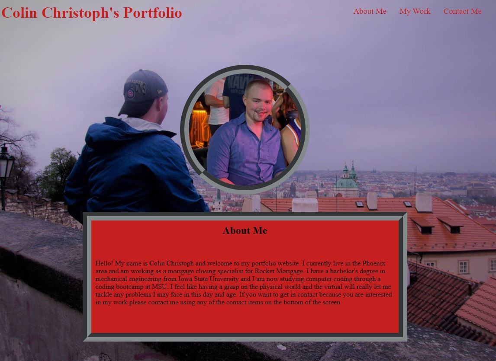

# Portfolio: Challenge 2

# Project Description:
The goal of this project is to creat e a portfolio website that follow the acceptance criteria below

# Acceptance Criteria
GIVEN I need to sample a potential employee's previous work
1. WHEN I load their portfolio
THEN I am presented with the developer's name, a recent photo or avatar, and links to sections about them, their work, and how to contact them
2. WHEN I click one of the links in the navigation
THEN the UI scrolls to the corresponding section
3. WHEN I click on the link to the section about their work
THEN the UI scrolls to a section with titled images of the developer's applications
4. WHEN I am presented with the developer's first application
THEN that application's image should be larger in size than the others
5. WHEN I click on the images of the applications
THEN I am taken to that deployed application
6. WHEN I resize the page or view the site on various screens and devices
THEN I am presented with a responsive layout that adapts to my viewport

# Final webpage link and screenshot
Link: [Colin Christoph's Portfolio](https://colinc27.github.io/PortfolioChallenge2/)

# Notes on this project:
1. The links for both 3D printing and Machining take you to different websites that are not mine. These are there simply to show the sites functionality. While I have tons of projects gathering all the photos and all the extra stuff necessary would be too time conuming for this challenge. I will definitaly revisit in the future.

